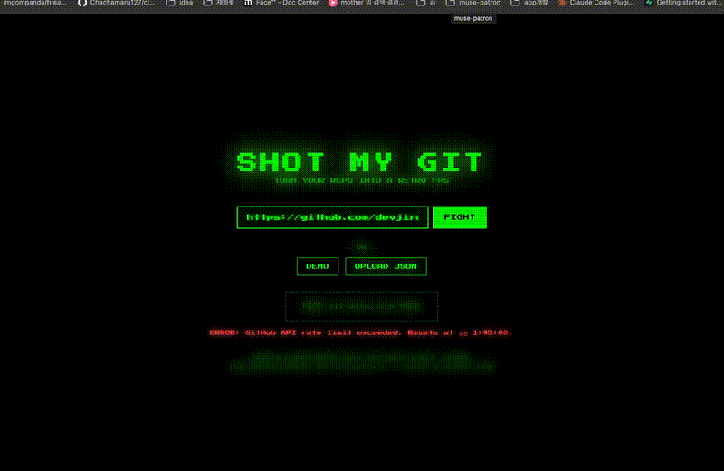

<div align="center">

# SHOT MY GIT

### Turn your git repo into a retro FPS



**[Play Now](https://devjiro76.github.io/shot-my-git/)** | **[Source](https://github.com/devjiro76/shot-my-git)**

</div>

---

Bug-fix commits become **bosses**. Your code commits become **bullets**. Shoot your way through 10 waves of bugs from any public GitHub repo.

## How It Works

1. Paste any GitHub repo URL and hit **FIGHT**
2. Bug-fix commits (`fix`, `hotfix`, `patch`...) spawn as bosses
3. Feature/refactor commits become your ammo
4. Clear 10 waves to win

## Boss Tiers

| Tier | Trigger | Movement |
|------|---------|----------|
| `MINI` | 1-2 files changed | Straight line |
| `NORMAL` | 3-5 files | Zigzag |
| `ELITE` | 6+ files or 100+ lines | Circle strafe |
| `MEGA` | Merge commits, 10+ files | Charge + escorts |

## Bullets = Your Code

Every bullet displays real content from your commits:

- Function/class names extracted from diffs
- Commit messages, SHAs, author names
- `+insertions / -deletions` stats
- Color-coded by type (feature=cyan, refactor=yellow, fix=red)

## Git Events

The game world reacts to your repo history:

- **Merge** &mdash; two text sprites collide and explode
- **Branch** &mdash; Y-shaped fork in the sky
- **Tag** &mdash; golden version number drops from above
- **Code Rain** &mdash; actual diff code rains in the background

## Quick Start

```bash
# play online
https://devjiro76.github.io/shot-my-git/

# or run locally
git clone https://github.com/devjiro76/shot-my-git.git
cd shot-my-git
npm install
npm run dev
```

## Private Repos

The live site uses GitHub's public API (60 req/hr, no auth needed). For private repos:

```bash
npm run extract -- /path/to/your/repo
# generates public/git-data.json
# drag & drop the file into the game, or run npm run dev
```

## Stack

- **Three.js** &mdash; 3D rendering with low-res pixel aesthetic
- **TypeScript + Vite** &mdash; build tooling
- **Canvas2D &rarr; CanvasTexture** &mdash; text sprite rendering
- **GitHub REST API** &mdash; client-side, no backend
- **GitHub Pages** &mdash; static hosting

## Controls

| Key | Action |
|-----|--------|
| Click / Space | Shoot |
| W A S D | Move |
| Mouse | Look around |
| ESC | Release cursor |

## License

MIT

---

<div align="center">

*Every developer has fought bugs. Now you can literally shoot them.*

</div>
